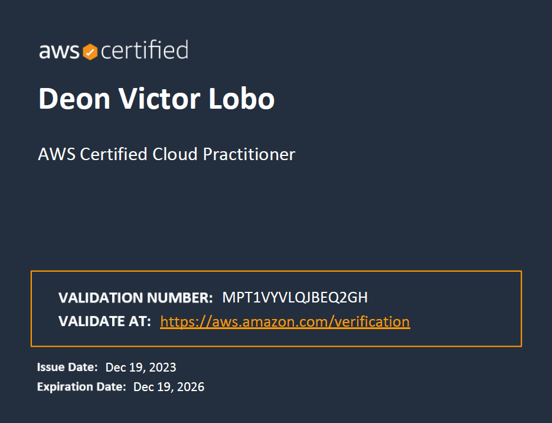
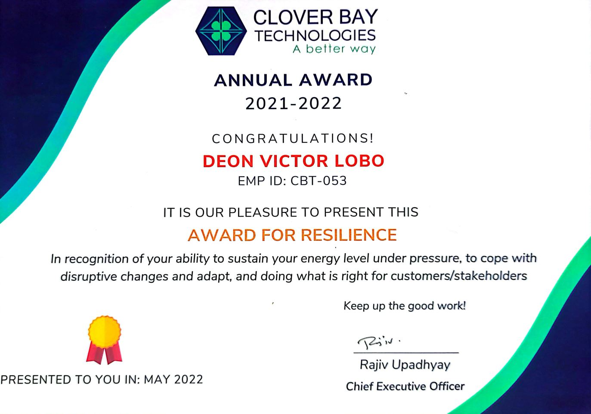
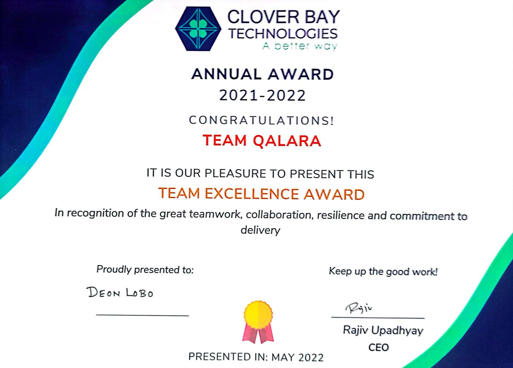
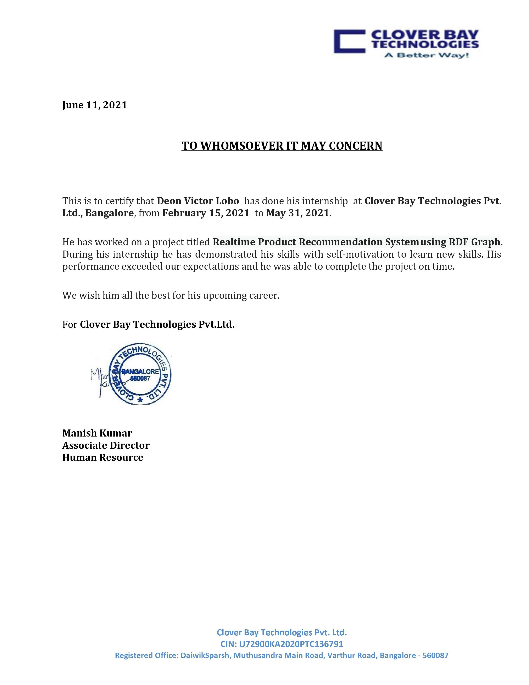
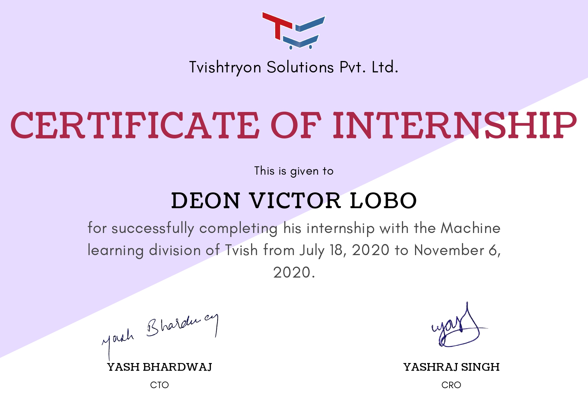
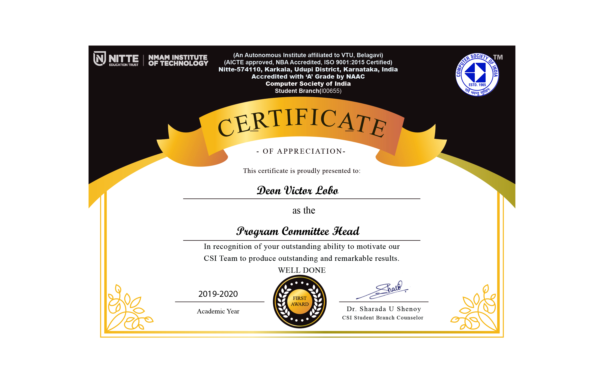
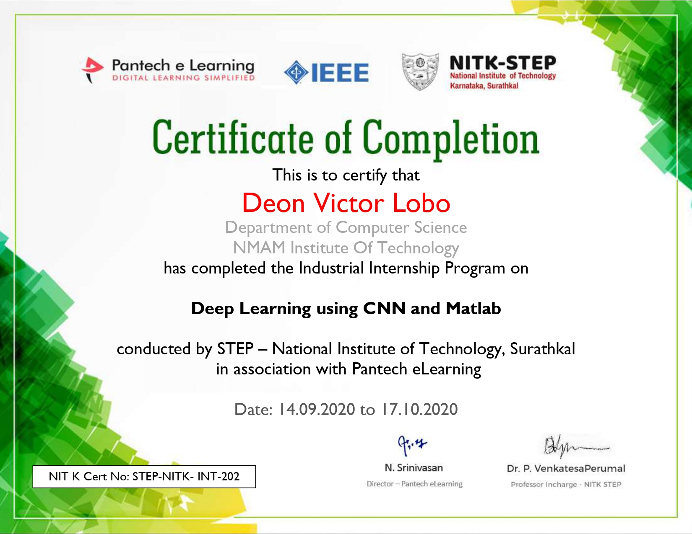
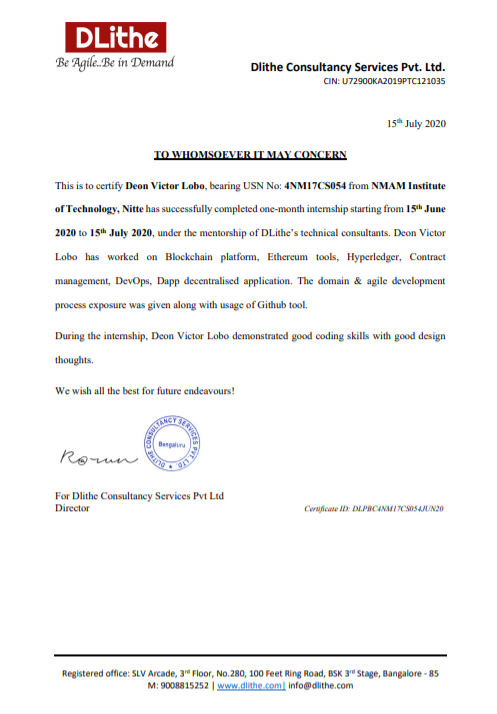
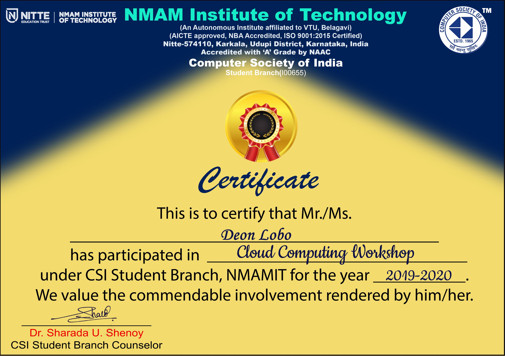
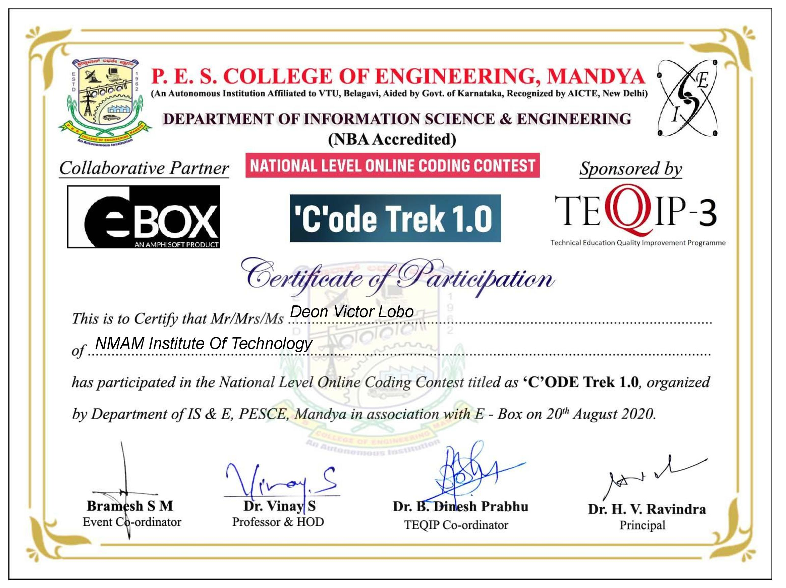

# Certificates-Awarded
<ol>
   <li><h2>AWS Certified Cloud Practitioner certificate</h2></li>
  
  
  <li><h2>Award For Resilience</h2></li>
  
  
  <li><h2>Team Excellence Award</h2></li>
  
  
  <li><h2>Engineer Intern-3.5 months</h2></li>
  
  
  <li><h2>Research Intern-3.months</h2></li>
  
  
  <li><h2>Program Committe Head</h2></li>
  
  
  <li><h2Industrial Internship Program on Deep Learning using CNN and Matlab</h2></li>
  
  
  <li><h2>Blockchain Internship</h2></li>
  

  <li><h2>The Complete Android N Developer Course</h2></li>
  
  
  <li><h2>The Complete Web Developer in 2020: Zero to Mastery</h2></li>
  
  
  <li><h2>The Ultimate Hands-On Hadoop - Tame your Big Data!</h2></li>
  
  
  <li><h2>Java Level 1</h2></li>
  
  
  <li><h2>Java Level 2</h2></li>
  
  
  <li><h2>Cloud Computing Workshop</h2></li>
  
  
  <li><h2>Fundamentals Of Digital Marketing</h2></li>
  
  
  <li><h2>CodeTrek</h2></li>
  
 
</ol>
