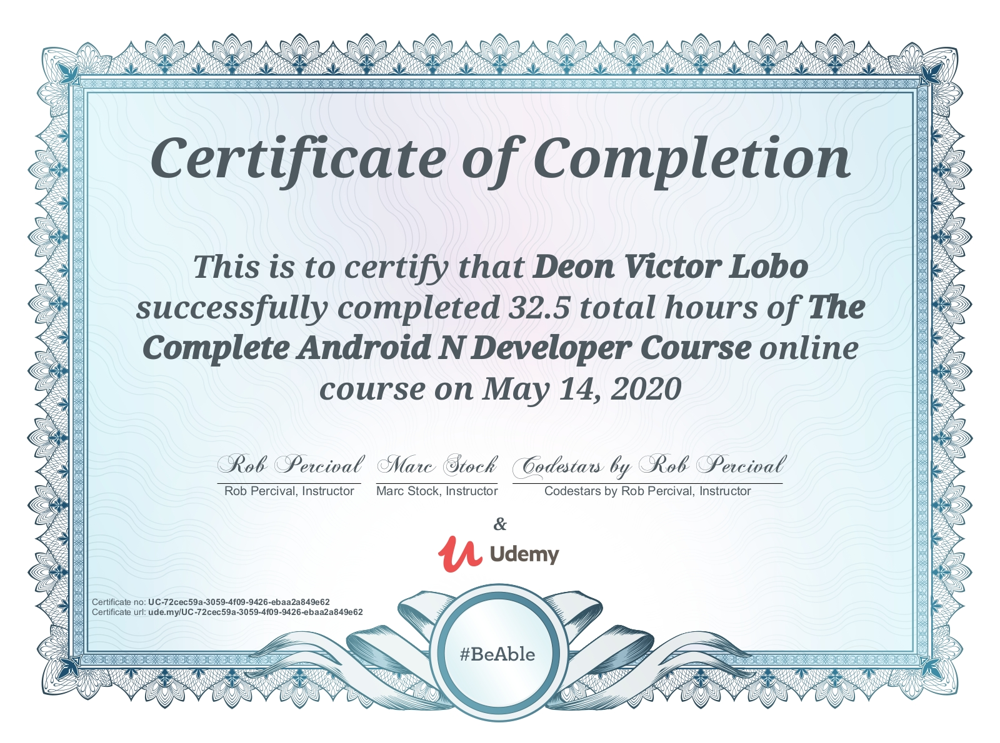
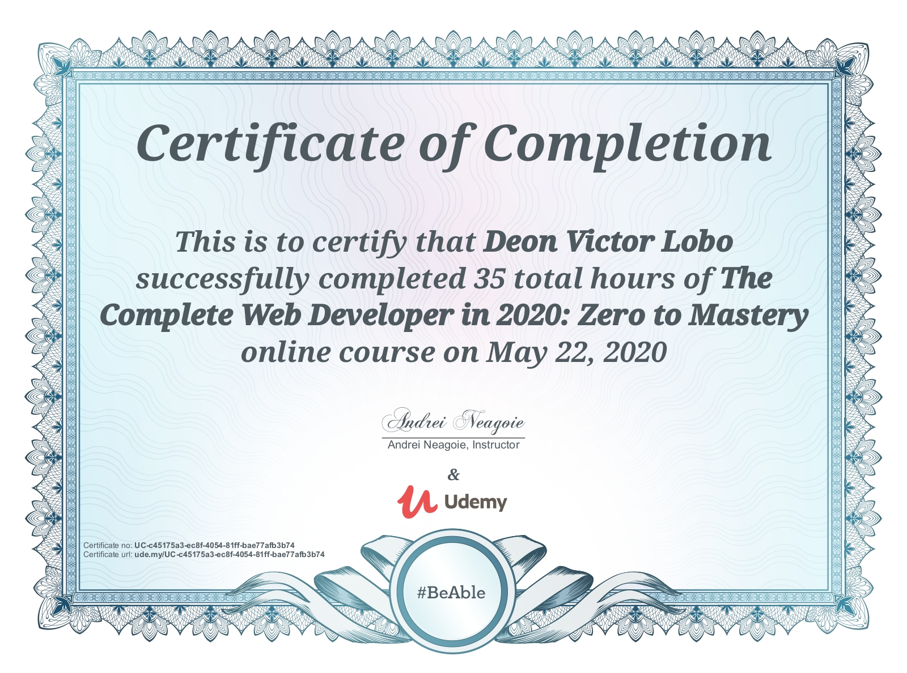
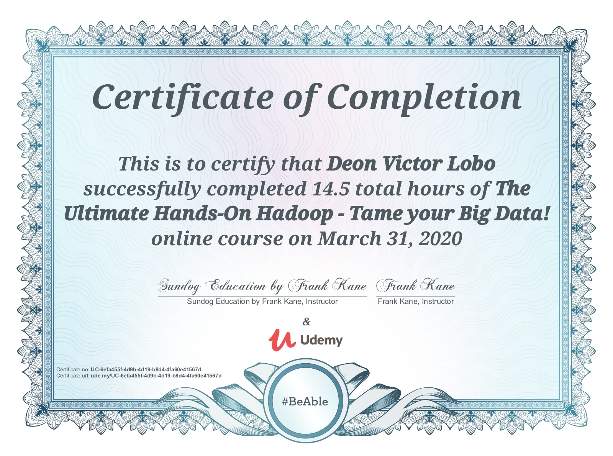
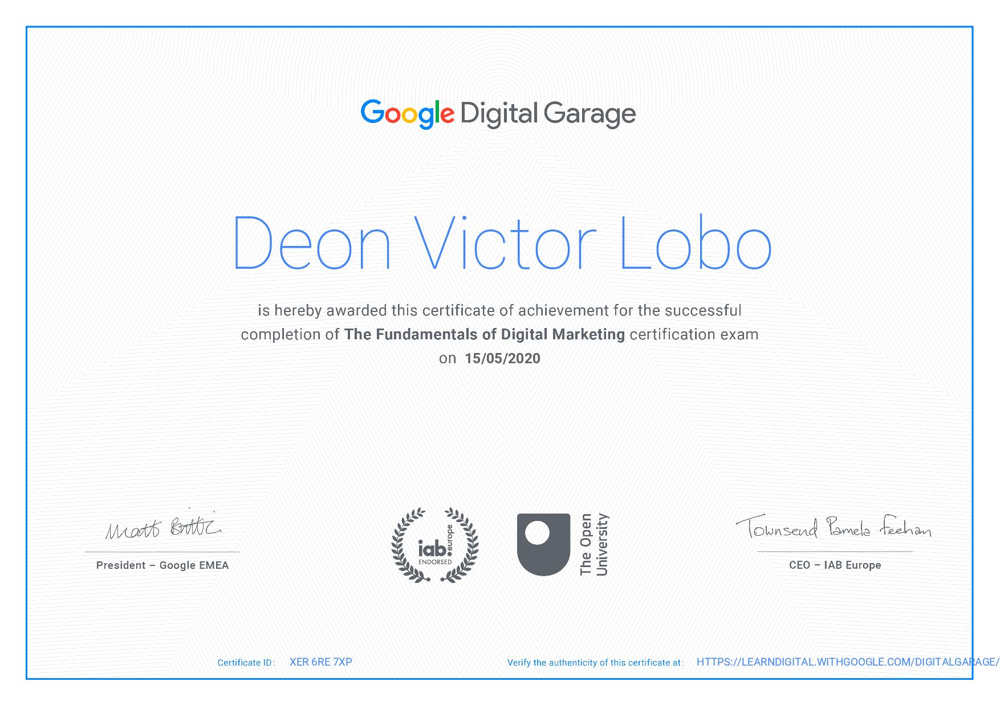

# Certificates-Awarded
<ol>
  <li><h2>Blockchain Internship</h2></li>
  

  <li><h2>The Complete Android N Developer Course</h2></li>
  
  
  <li><h2>The Complete Web Developer in 2020: Zero to Mastery</h2></li>
  
  
  <li><h2>The Ultimate Hands-On Hadoop - Tame your Big Data!</h2></li>
  
  
  <li><h2>Java Level 1</h2></li>
  
  
  <li><h2>Java Level 2</h2></li>
  
  
  <li><h2>Fundamentals Of Digital Marketing</h2></li>
  
 
</ol>
